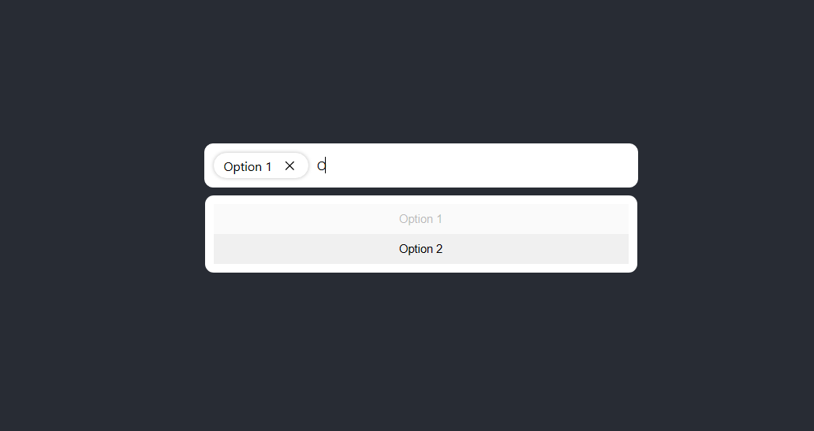

# React AutoFill Box

## Installation

To install, run

```
npm i react-auto-fill-box
```

## Usage

### Example

#### Code

```js
import AutoFillBox from 'react-auto-fill-box';
import { useEffect, useState } from 'react';

function App() {
const [selectionValues, setSelectionValues] = useState([])

  useEffect(()=>{
    console.log(selectionValues)
  }, [selectionValues])

  return (
    <div className="App">
      <header className="App-header">
        <AutoFillBox onSelectionUpdate={setSelectionValues} width="500px" optionsList={[
          'Option 1',
          'Option 2'
        ]} />
      </header>
    </div>
  );
}

export default App;

```

#### Preview


### API

| Name | Type | Default | Description |
| ---- | ---- | ---- | ---- |
| `className` | `string` | -- | Additional Class Name for AutoFillBox. This does **NOT** override the default styles, only appends to them.  |
| `selectedOptionClassName` | `string` | -- | Additional Class Name for AutoFillBox Item. This does **NOT** override the default styles, only appends to them. |
| `optionsList` | `string[]` | `[]` | A List of Values for the user to choose from. By default, values other than those in this `optionList` are also accepted. To prevent this behaviour, modify the function passed through `customValueValidator` accordingly. |
| `onSelectionUpdate` | `function` | `undefined` | A callback which is to be run whenever the selected options are updated. The selected entries are passed as a `string[]` parameter to the function. <br />**WARNING :** If you don't use this callback you will not be able to access the selected values. |
| `customValueValidator` | `function` | `(value) => true` | A Function to validate custom entries that are not present in `optionsList`. Must return `true` for a valid entry, and `false` otherwise. This can be useful in a scenario such as an email input field, where you have contacts, but also other email address as valid entries. <br /> **NOTE :** Pass an empty function that returns `false` to prevent custom values. |
| `selectorKeys` | `string[]` | `["Enter", "Tab"]` | The keyboard keys to be used for validating and accepting an option. <br /> **WARNING :** Using the keys here overrides the default behaviour of the keys, so choose them wisely. |
| `width` | `string` | `"auto"` | Width of the AutoFill Box. Alternatively you can specific width in a class name and assign that class name to `className` property. (You might need to mark the width CSS property as `!important`) |
